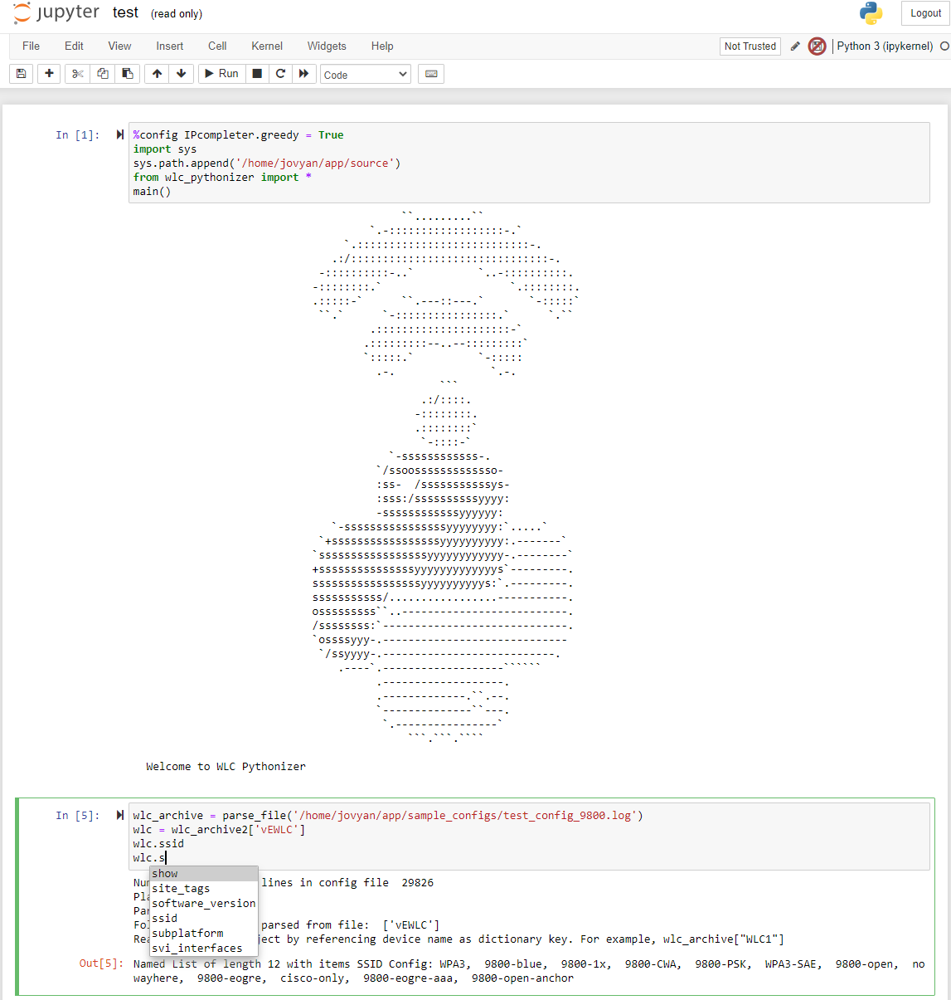
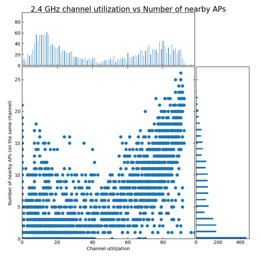

# Cisco WLC Pythonizer

Python script to convert Cisco WLC config file into simple and intuitive Python data object.

This conversion will allow you to solve many day-to-day problems and analyse many aspects of your Cisco wireless network by:
* using the large (and growing) library of ready-to-use functions already included in code
* operating WLC config object(s) with any standard but powerful Python methods, for example list comprehensions 

Some examples of problems that can be solved by this tool are provided below.

## Some examples of use cases for this tool
* What changed in the WLC configuration since the last (day, week, month)?
* Which rogue APs have the most impact on our network?
* Which access points are busiest by the number of clients (or channel utilization etc.)
* Get statistics for channel utilization in my wireless network (or its part, for example specific site)
* Visualize important network parameters and its changes over time
* Apply best practice rules – update, adjust and customize them if needed
* How diverse is my wireless network configuration?
* Any ~~crazy~~ innovative idea that comes to your mind and can be solved based on data from WLC config

This tool works for both AireOS and Catalyst 9800 WLC.

More usage examples are provided in [README file](./docs/README.MD).

## Getting Started
The application is container-ready. This means that there is no need for cumbersome installation of all necessary Python libraries.
You will be ready to start your analysis in just 3 simple steps:
* download Docker container from [Docker hub](https://hub.docker.com/repository/docker/wlcpython/cisco-wlc-pythonizer) or pull by using command __docker pull wlcpython/cisco-wlc-pythonizer:latest__
* start container by following command: docker run -p 8888:8888 -v ~:/tmp:ro wlc-pythonizer
* open the Jupyter notebook with interactive tutorial in your browser http://127.0.0.1:8888/notebooks/app/notebooks/tutorial.ipynb

In order to know what this tool can do for you, try the following:
* [documentation](./docs/README.MD)
* [demo presentation](./docs/demo-presentation/Pythonize_Cisco_WLC_config.pdf)

## Usage or How to work with this tool

**IDEA** is the recommended approach for using this tool:
* **ID** - Import config Data
* **E** - Explore the data 
* **A** - Analyze the data

***Some usage examples:***

Quickly find needed parameter values and config objects with built-in GREP function:
   
    #Find all timeouts for SSID with name 'CISCO'
    wlc.ssid['CISCO'].grep('second’)
    
        SSID config CISCO exclusionlist_timeout 60 seconds
        SSID config CISCO session_timeout 1800 seconds
        SSID config CISCO scan_defer_time 100 milliseconds
    
    #Find all radios with FAILED profiles
    wlc.ap_rf.grep('FAIL’)
    
        AP RF config MSK-1109_slot0 interference_profile FAILED
        AP RF config SPB-1305_slot0 noise_profile FAILED

Get the names of SSIDs in Disabled status:

    [ssid.name for ssid in wlc.ssid if ssid.status == 'Disabled’]
    
        ['Guest_WiFi']

Get the names of SSIDs with CWA ('Guest' in name and AAA override enabled):

    [ssid.name for ssid in wlc.ssid 
    if ssid.aaa_policy_override == 'Enabled’ and 'Guest' in ssid.name]
       
        ['Guest_WiFi']

***Example of diagram to check if channel utilization depends on the number of nearby APs on the same channel:***

    utilization_same_channel_nearby_aps_scatterplot(wlc_archive)

More information in extended [README](./docs/README.MD).

## Contributing

Any contributor is more than welcome! I have a lot of ideas to implement and welcome any other ideas!

[Contribution guidelines for this project](./docs/CONTRIBUTING.md)

## How to get in touch for support\questions\ideas etc. 
Collaboration via github tools is the preferred way, so open the issue, make pull request, fork, star etc.

## License

This project is covered under the terms described in [LICENSE](./LICENSE)

