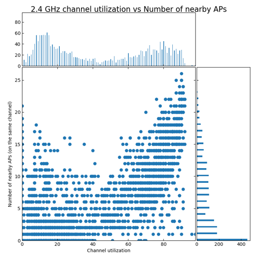

# Cisco WLC Pythonizer

Python script to convert Cisco WLC config file into simple and intuitive Python data object.

Using this tool you will be able to solve many day-to-day problems and analyse many aspects of your Cisco wireless network by:
* using the large (and growing) library of ready-to-use features already included in code
* operating WLC config object(s) with any standard but powerful Python methods 

## Project goals
Every network engineer who tried to work with WLC config files knows that it is quite large text file containing a mix of semi-structured configuration and operational data for Cisco wireless network. This file contains **a lot of useful information in hard-to-read format**. 

The general idea of this project was to combine two simple parts in order to get powerful results:
* your knowledge of wireless network as wireless engineer
* basic knowledge of Python data structures and tools

That is why this project started some time ago with the following goals in mind:
* Solve the problems asked by wireless network engineers\users
* Save all historical configuration and operational data in easy-to-use format (export as pickle, json, yaml etc.)
* Get quick answer on my (and now yours) fingertips by easy-to-use filters
* Be able to visualize data to find hidden patterns
* Try AI (yes, artificial intelligence) capabilities on collected dataset (*in future releases)

## Usage or How to work with this tool
**IDEA** is the recommended approach for using this tool:
* **ID** - Import config Data
* **E** - Explore the data 
* **A** - Analyze the data

More details below.

### Pre-requisites:
* Ask yourself a question (or get asked by others). Think about if the data from WLC can backup your answer\hypothesis.
* Import WLC configuration (or many configurations) and explore the data.
### If ready-to-use solution already exists in tool library
* Use function from library to analyse your data (check for available functions here)
### If ready-to-use solution not available in tool
* Process the data to get desired output manually (for inspiration look here (ADD REFERENCE to list comprehensions))
* Write your own Python function in order to re-use it later when need comes
* Contribute this function to this project for enabling other colleagues to re-use it. (Optional but highly recommended step)

If you feel ready to start but do not know how to deal with it:

 1. Watch tool introduction and short demo in DevNet Create 2021 
 [link](https://https://developer.cisco.com/devnetcreate/2021) 
 2. Download and open presentation [pdf.file](./demo-presentation/Pythonize_Cisco_WLC_config.pdf)  and use it as reference in your tests
 3. Try to follow short tutorial [TUTORIAL.md](TUTORIAL.md)

## How to import data from WLC into this tool
* Read it from text file (or all files in one directory)
* Collect it directly from WLC via SSH 
* Collect it from Cisco DNA Center via API

### Read from text file

Just call function __parse_file__(filename)

    wlcs = parse_file('wlc_config_example.txt’)
    
    Following WLCs were parsed from file:  ['tac-test’, ‘wlc2’]

### Read all files from folder

Just call function __read_folder__(foldername)

    wlcs = read_folder('my_configs’)
    <Some output omitted>
    Following WLCs were parsed :  ['wlc1’, ‘wlc2’]

### Collect config file directly from WLC via SSH 

Just call function __ssh_collect__()

    wlcs = ssh_collect()
    
    Collecting config from WLC via SSH
    WLC IP address, please: >? 10.11.12.13
    Your username, please: >? admin
    Your password, please: >? *******
    sending username...
    sending pwd...
    Please, hold on, getting config, it can take some time...
    Collection is completed
    Please, hold on, parsing configs, it can take some time...
    Configs are written to file with name:  WLC_config-IP 10.11.12.13-Tue Aug 7 111500 2021.txt
    Configs are sent to parser….
    Following WLCs were parsed…

### Collect WLC config file from Cisco DNA Center via API

    wlcs = dnac_get_wlc_configs()
    Enter the IP address of DNAC, please: >? 192.168.44.44
    Your username, please: >? user
    Your password, please: >? ****
    Contacting Cisco DNA Center with IP address:  192.168.44.44
    for username:  user
    Following WLC devices are found and reachable: 
    sdc1wlc001
    Starting config collection...
    Waiting for collection results ...
    DNA Center collected configs, grabbing config files from it...
    WLC config files are successfully collected
    Configs are written to file with name:  all_WLC_config-DNAC-
    Configs are sent to parser
    ...
    Following WLCs were parsed from file:  ['sdc1wlc001']

## Tools already available for data analysis

The library included in tool will help you to easily analyze the data without possessing programming skills.
Although we highly recommend you to explore and get used to data model via provided [short tutorial](#short-tutorial-based-on-demo-data).
Please find the main functions categorized and described in list below.

Please, be aware, that the library is growing and despite the efforts this description may become outdated to some extent.

* [Channel utilization analysis](#channel-utilization-analysis)
* [Rogue AP analysis](#rogue-AP-analysis)
* [Data exploration](#data-exploration)
* [Examples of Python list comprehensions to process meaningful results](#examples-of-python-list-comprehensions)
* [Best practices analysis](#best-practices-analysis)

### Data exploration

It is easy to get lost in all the configuration and operational data that is contained in WLC config object!
First of all, it is recommended to follow the short tutorial in order to get the feeling on how to use powerful "Wlc_Config" class (ADD REFERENCE HERE).
When you tried to follow examples, you can easily navigate to the data you need the most. 
There is a number of functions that can help you to easily explore this large amount of data. These functions are described in this part.

List of available data exploration functions:
* [Display all values in config section](#display-all-values-in-config-section)
* [Filter long lists](#filter-long-lists)
* [Quickly find interesting attribute or value (GREP)](#quickly-find-interesting-attribute-or-value-in-wlc-config)

#### Display all values in config section

***Why this function exists?*** 

If this sounds to you like a famous "show" command in CLI, it really is! "Show" in fact has the same syntax and meaning.
Just print "show" before or even after the object and press Enter.

    show(object)
    object.show()

        Parameters: 
            object (built-in class): 
                any part of the Wlc_Config class. 
          
        Returns: 
            Prints all attributes and its values 

***Example of output:***

    wlc.ipv6.show()
    show(wlc.ipv6)
    
    objname IPv6 global configuration
    type config
    global_config Enabled
    reachable_lifetime_value 300
    stale_lifetime_value 86400
    down_lifetime_value 30
    ra_throttling Disabled
    ra_throttling_allow_at_least 1
    ra_throttling_allow_at_most 1
    ra_throttling_max_through 10
    ra_throttling_throttle_period 600
    ra_throttling_interval_option passthrough
    ns_mulitcast_cachemiss_forwarding Disabled
    na_mulitcast_forwarding Enabled
    ipv6_capwap_udp_lite Enabled
    operating_system_ipv6_state Enabled

#### Filter long lists
***Why this function exists?*** 

Large WLC configs with high number of associated APs and clients can return very long lists.
Tool has built-in function to filter such lists and get only items you are interested in your analysis. 

    object.filter(<ATTRIBUTE NAME>,<VALUE>)

        Parameters: 
            object (built-in class): 
                any part of the Wlc_Config class. 
          
        Returns: 
            The list of items with matched attributes and its values 

***Example of output:***
    
    💡 The first attempt returns notoriously long list... 
    wlc.rogue_aps
    
        Named List of length 566 with items Rogue_AP: 00:0c:e7:61:dd:6c,  00:0c:f6:e9:e6:ee,  00:0e:8f:23:36:7c,  00:0e:8f:23:5e:cc, <..output omitted..>
    
    💡 Let's filter once by channel
    rt.rogue_aps.filter('channel','13')
    
        Named List of length 12 with items Rogue_AP: 0c:b6:d2:8a:9e:41,  14:2e:5e:57:5e:bc,  44:13:d0:9b:50:d3,  44:13:d0:9b:76:a7,  44:13:d0:b9:48:e1, <..output omitted..>
    
    💡 Let's filter twice BOTH by channel AND state and it becomes much more manageable
    wlc.rogue_aps.filter('channel','13').filter('state','Alert')
    
        Named List of length 3 with items Rogue_AP: 0c:b6:d2:8a:9e:41,  14:2e:5e:57:5e:bc,  44:13:d0:9b:50:d3

#### Quickly find interesting attribute or value in WLC config
***Why this function exists?*** 

You forgot how this config section or attribute is named. Yes, it happened with you and other engineers so many times before!
No need to blame your memory, just search the necessary data by using well-known "grep".

    grep(object,’value’)
    object.grep(‘value’)

        Parameters: 
            object (built-in class): 
                any part of the Wlc_Config class.
            value (string):
                anything that you try to find ;) 
      
        Returns: 
            Prints all attributes and its values which matched 'value'

***Example of output:***

    #Find all IPv6 MLD parameters
    wlc.grep('mld’)
     
        WLC network config mld_snooping Enabled
        WLC network config mld_timeout 60 seconds
        WLC network config mld_query_interval 20 seconds
    
    #Find all timeouts for SSID with name 'CISCO'
    wlc.ssid['CISCO'].grep('second’)
    
        SSID config CISCO exclusionlist_timeout 60 seconds
        SSID config CISCO session_timeout 1800 seconds
        SSID config CISCO scan_defer_time 100 milliseconds
    
    #Find all radios with FAILED profiles
    wlc.ap_rf.grep('FAIL’)
    
        AP RF config MSK-1109_slot0 interference_profile FAILED
        AP RF config SPB-1305_slot0 noise_profile FAILED

### Examples of Python list comprehensions

List comprehension is an elegant way to define and create lists based on existing lists.
It is so useful and powerful that it is almost necessary to put it into your tool belt.
This part will show some examples of how to use it in order to solve some practical tasks.
You can use them in order to define your own useful functions and [contribute](#contributing) them to tool library.

***Usage examples:***

Get all names of SSIDs configured in WLC:
    
    [ssid.name for ssid in wlc.ssid] 
    
        ['CISCO',
         'Guest_WiFi',
         'rtk.msk',
         'CSC Provision',
         'CSC Corporate']

Get names and status of SSIDs configured in WLC:
    
    [(ssid.name, ssid.status) for ssid in wlc.ssid] 
    
        [('CISCO', 'Enabled'),
        ('Guest_WiFi', 'Disabled'),
        ('rtk.msk', 'Enabled'),
        ('CSC Provision', 'Enabled'),
        ('CSC Corporate', 'Enabled')]

Get the names of SSIDs in Disabled status:

    [ssid.name for ssid in wlc.ssid if ssid.status == 'Disabled’]
    
        ['Guest_WiFi']

Get the names of SSIDs with AAA override:

    [ssid.name for ssid in wlc.ssid 
    if ssid.aaa_policy_override == 'Enabled’]
    
        ['CSC Corporate']

Get the names of SSIDs with CWA ('Guest' in name and AAA override enabled):

    [ssid.name for ssid in wlc.ssid 
    if ssid.aaa_policy_override == 'Enabled’ and 'Guest' in ssid.name]
       
        ['Guest_WiFi']

### Rogue AP analysis
Rogue APs are just all other Wi-Fi access points heard by your own APs. 
Depending on a number of parameters, they can be harmful for your WLAN security and performance.

***Why this function exists?*** 

It allows to quickly get the "big picture" of rogue APs in wireless network under analysis.
It prints the text output covering four main aspects of rogue APs:
* Histogram of rogue APs vs signal level, which allows us to estimate how many of rogue APs are close to our own APs and may have a greater impact.
* Rogue APs with higher impact on our network. Currently hardcoded values for impact are **RSSI > -50 dBm** and ***number of detecting APs > 3***. These APs should be checked first.
* Our own APs which are most impacted by rogue APs with current channel utilization of its radios.
* Manufacturers of rogue APs. This information allows us to estimate possible efforts to coordinate RF usage with rogue AP owners. For example, it will be easy to 

  
    rogue_ap_summary(wlc_config)    
        Parameters: 
            wlc_config: 
                The WLC config class. 
          
        Returns: 
            None but prints nice summary output. 
 
***Example of output:***

    rogue_ap_summary(wlc_config)

    💡 See how many rogue APs are dangerous ones (close to our APs)
    Rogue AP summary for  MY_WLC:
    The overall number of rogue APs : 1998
    The number of rogue AP with highest RSSI  -10  dBm =  0
    The number of rogue AP with highest RSSI  -20  dBm =  5
    The number of rogue AP with highest RSSI  -30  dBm =  19
    The number of rogue AP with highest RSSI  -40  dBm =  51
    The number of rogue AP with highest RSSI  -50  dBm =  125
    The number of rogue AP with highest RSSI  -60  dBm =  236
    The number of rogue AP with highest RSSI  -70  dBm =  432
    The number of rogue AP with highest RSSI  -80  dBm =  853
    The number of rogue AP with highest RSSI  -90  dBm =  1989
    
    💡 See which rogue APs has the most impact
    The most impacting rogue APs in this environment: 
    54:4a:00:d1:fd:00  #Check these rogues first – they have high impact
    a0:93:51:38:a8:60
    f0:9e:63:70:ef:b0
    00:fc:ba:0b:b9:e0
    <..output omitted..>
    
    💡 See which APs from our network are impacted
    The impacted APs in this environment: 
    WA-0MSK-MDM5-001-1100 60 %
    WA-0MSK-VOR1-006-7CWK 30 %
    WA-0MSK-VR52-001-2215 20 %
    WA-0MSK-ZM15-007-5CWK 53 %
    WA-0MSK-DR31-003-3300 28 %
    WA-0MSK-DR32-003-4400 16 %
    <..output omitted..>
    
    💡 Know manufacturers of rogue APs
    Most common manufacturers of rogue APs are:  
    [('Cisco', 199), ('Sercomm', 168), ('RuckusWi', 158), ('ZyxelCom', 127), ('Routerboard', 115)]

There is slightly better and more advanced version of this function which analyzes time-series of WLC configs and allows additional filtering.
This comes really handy for more focused and advanced analysis of rogue APs and its impact over some time period.

    rogue_ap_time(archive, rssi_threshold = -50, detecting_aps = 3, rogue_clients = 0, site_name = '')
        Parameters: 
            archive of wlc_configs (built-in class): 
                The archive of WLC configs collected in some time period.
            rssi_threshold (int): (default is -50 - quite aggressive): 
                filter rogue APs with RSSI higher than this threshold
            detecting_aps (int): (default is 3 - quite aggressive): 
                filter rogue APs which are heard by not less than this number of our own APs
            rogue_clients (int): (default is 0 - no clients): 
                filter rogue APs which have a number of rogue clients connected more or equal to this threshold
            site_name (str): (default is '' - all sites)
                AP name should contain this substring 
          
        Returns: 
            None but prints nice summary output which allows much deeper analysis of rogue AP and its impact over some time period. 

***Example of output:***

    rogue_ap_time(archive,-60,2,1,'MSK-PPK-E-FL09')
    _____________________________________
    Rogue AP MAC address:  18:f0:e4:e4:65:c5  Frequency:  9  Impacted AP name:  MSK-PPK-E-FL09_2-AP25
    Rogue AP vendor:  ['XiaomiCo']
    Average channel utilization 2.4 GHz =  29.33 Channel utilization history 2.4 GHz:   [24, 16, 19, 21, 27, 26, 37, 24, 30, 26, 75, 27]
    Average channel utilization    5 GHz =  0.92 Channel utilization history    5 GHz:   [1, 3, 1, 1, 1, 0, 1, 0, 1, 1, 1, 0]
    _____________________________________
    Rogue AP MAC address:  74:4d:28:15:5e:9c  Frequency:  4  Impacted AP name:  MSK-PPK-E-FL09_3-AP70
    Rogue AP vendor:  ['Routerboard']
    Average channel utilization 2.4 GHz =  28.2 Channel utilization history 2.4 GHz:   [24, 28, 30, 26, 33]
    Average channel utilization    5 GHz =  5.2 Channel utilization history    5 GHz:   [21, 0, 1, 3, 1]
    _____________________________________
    Rogue AP MAC address:  f4:f5:24:d1:82:0b  Frequency:  7  Impacted AP name:  MSK-PPK-E-FL09_2-AP37
    Rogue AP vendor:  ['Motorola']
    Average channel utilization 2.4 GHz =  14.56 Channel utilization history 2.4 GHz:   [49, 10, 10, 9, 5, 12, 20, 9, 7]
    Average channel utilization    5 GHz =  1.0 Channel utilization history    5 GHz:   [1, 0, 0, 1, 3, 1, 1, 1, 1]
    <..output omitted..>

### Channel utilization analysis
Channel utilization is very important parameter to consider during WLAN performance optimization activities.
WLC config files contains a lot of operational parameters, channel utilization is not an exception here.
AP RF section of WLC config class contains 3 values for every radio:
* Overall channel utilization
* Channel utilization caused by receiving data by AP radio
* Channel utilization caused by transmitting data by AP radio 

These values can easily be found by using the following command:

    wlc.ap_rf.grep('util')
    ...
    AP RF config WL-AP3502i-ASK1.3-4_slot0 load_profile_receive_utilization 0 %
    AP RF config WL-AP3502i-ASK1.3-4_slot0 load_profile_transmit_utilization 1 %
    AP RF config WL-AP3502i-ASK1.3-4_slot0 load_profile_channel_utilization 15 %
    ...

But there is no great value in using this raw data. Let's try to do something cool and even visualize!

List of available channel utilization functions:
* [Channel utilization statistics](#channel-utilization-statistics)
* [Find APs with high channel utilization](#find-aps-with-high-channel-utilization)
* [Visualize changes of channel utilization over time](#visualize-channel-utilization-changes-in-time)
* [Scatter plot of channel utilization vs number of clients](#scatter-plot-of-channel-utilization-vs-number-of-clients)
* [Scatter plot of channel utilization vs nearby APs](#scatter-plot-of-channel-utilization-vs-nearby-aps)
* [Scatter plot of channel utilization vs rogue APs](#scatter-plot-of-channel-utilization-vs-rogue-aps)

#### Channel utilization statistics
       
***Why this function exists?*** 

It allows to quickly get the "big picture" of channel utilization in wireless network under analysis. 
  
    utilization_statistics    
        Parameters: 
            wlc_config: 
                The WLC config class. 
          
        Returns: 
            average24, min24, max24, average5, min5, max5: 
                Average, minimum, maximum value of channel utilization per frequency band. 
 
***Example of output:***

    utilization_statistics(wlc,True)
    
    Channel utilization 5GHz band for device MY_OLD_WLC:
    1.37 0 17
    Channel utilization 2.4GHz band for device MY_OLD_WLC:
    21.13 3 70

#### Find APs with high channel utilization
       
***Why this function exists?***

It allows to filter AP radios and find the list of APs with high channel utilization at site under analysis.
It is really handy to find "bad guys" who are performing bad in your wireless network.  
  
    bad_utilization_aps
        Parameters: 
            wlc_config (built-in class): 
                The WLC config class. 
            utilization_diff_threshold (int): 
                Find AP radios with utilization higher than this threshold
            site_name (str): 
                AP name should contain this substring (default is '' - all sites)
          
        Returns: 
            dictionary with:
             AP name + slot as key
             list of [channel utilization, rx_channel_utilization, tx_channel_utiliization] as value 
             

***Example of output:***

    bad_utilization_aps(wlc,30,'AK2')
    
    {'WL-AP3502i-AK2.7-6_slot0': [32, 0, 0],
     'WL-AP3502i-AK2.7-2_slot0': [40, 0, 0],
     'WL-AP3502i-AK2.3-8_slot0': [38, 0, 0],
     'WL-AP3702i-AK2.4-8_slot0': [32, 0, 0]}

#### Visualize channel utilization changes in time

***Why this function exists?***
 
One WLC config contains the snapshot of current wireless network state at time it was taken.
Almost every wireless network is highly dynamic structure with a lot of changes going on in every moment of time.
Channel utilization behaves similarly. And there is no great point to observe only one observation of this parameter.
It is much better to take time-series and see how this parameter is changing with time.
Channel utilization can increase with client load and decrease when client leave the coverage zone or not exchanging data and it is pretty normal!
But every AP radio that sees constantly high channel utilization definitely deserves your attention!
This functions will help you to visualize and quickly see "bad guys" with your own eyes.
  
     channel_utilization_visual
        Parameters: 
            archive of wlc_configs (built-in class): 
                The archive of WLC configs collected in some time period. 
          
        Returns: 
            channel_utilization dictionary with:
             [wlc][band][ap_slot] as keys 
             list of channel utilization values in time

***Example of output:***

    channel_utilization_visual(wlc_archive)

There is also slightly better and more advanced version of this function which allows to filter AP list by site name and threshold in average channel utilization. 

    utilization_time
        Parameters: 
            archive of wlc_configs (built-in class): 
                The archive of WLC configs collected in some time period. 
            site_name (str): 
                AP name should contain this substring (default is '' - all sites)
            average_util2_threshold (int) (default is 0 - all AP radios): 
                Find AP radios with average utilization in 2.4 GHz band higher than this threshold
            average_util5_threshold (int) (default is 0 - all AP radios): 
                Find AP radios with average utilization in 5 GHz band higher than this threshold
          
        Returns: 
            FILTERED channel_utilization dictionary with:
             [wlc][band][ap_slot] as keys 
             list of channel utilization values in time

***Example of output:***

    utilization_time(wlc_archive,site_name = '',average_util2_threshold = 20,average_util5_threshold = 20)

    utilization_time(wlc_archive,site_name = '',average_util2_threshold = 45,average_util5_threshold = 45)

It is also recommended to use function read_folder (ADD REFERENCE) to quickly import a series of WLC config files.

#### Scatter plot of channel utilization vs number of clients
       
***Why this function exists?*** 

Ok, you have found the bad performing APs in your wireless network, now what? 
Let's experiment with data visualizations in order to find the real reason of high channel utilization.
One possible reason of high channel utilization is the load from your clients connected to this particular AP radio.
In order to check this hypothesis just run this command:

    utilization_clients_scatterplot
        Parameters: 
            archive of wlc_configs (built-in class): 
                The archive of WLC configs collected in some time period. 
          
        Returns: 
            None 

***Example of output:***

*Check out the red zones, these contain APs that have no client connected but high channel utilization*

    utilization_clients_scatterplot(wlc_archive)

#### Scatter plot of channel utilization vs nearby APs
       
***Why this function exists?*** 

Ok, you have found the bad performing APs in your wireless network, now what? 
Let's experiment with data visualizations in order to find the real reason of high channel utilization.
One possible reason of high channel utilization is the load from nearby APs in your network.

In order to check this hypothesis just run this command:

    utilization_nearby_aps_scatterplot(wlc_archive)
        Parameters: 
            archive of wlc_configs (built-in class): 
                The archive of WLC configs collected in some time period. 
          
        Returns: 
            None 

***Example of output:***

    utilization_nearby_aps_scatterplot(wlc_archive)

There is also slightly better and more advanced version of this function which allows to build the same diagram for nearby APs that use ***the same channel***.

    utilization_same_channel_nearby_aps_scatterplot(wlc_archive)
        Parameters: 
            archive of wlc_configs (built-in class): 
                The archive of WLC configs collected in some time period. 
          
        Returns: 
            None 
            
***Example of output:***

    utilization_same_channel_nearby_aps_scatterplot(wlc_archive)

#### Scatter plot of channel utilization vs rogue APs
       
***Why this function exists?*** 

Ok, you have found the bad performing APs in your wireless network, now what? 
Let's experiment with data visualizations in order to find the real reason of high channel utilization.
One possible reason of high channel utilization is the load from rogue APs heard by your own APs.
In order to check this hypothesis just run this command:

    utilization_rogue_aps_scatterplot(wlc_config)
        Parameters: 
            wlc_config (built-in class): 
                The WLC config class. 
          
        Returns: 
            None 

***Example of output:***

    utilization_rogue_aps_scatterplot(wlc)

## Best practices analysis

    bp_check(wlc)
    Best practices compliance report
    ID Status             Rate Name
    1 Compliant           100 Telnet should be disabled in all APs
    2 Compliant           100 Each SSID is mapped with unique interface in controller if no AAA override is enabled
    3 Compliant           100 Local Client profiling using HTTP and DHCP is enabled unless RADIUS profiling is in use
    4 Compliant           100 Dynamic interface should not have IP address 0.0.0.0
    5 Compliant           100 Primary and secondary DHCP server IP addresses are configured for WLC dynamic interfaces

## Short tutorial based on demo data

To be developed.

## Data model

### Why did you use customized Python object to describe WLC config?
The main drivers to use special Python object:
* Clear representation
* Human-readable syntax & context help 
* Customized methods for these objects (like compare config or its part, filter, grep etc.)
* Fast customization of object for your project (if needed)

## Contributing

Please read [CONTRIBUTING.md](CONTRIBUTING.md) for details on your possible contribution.

## Tested with:
* Python 3.7
* Cisco AireOS WLCs running software versions 8.0, 8.2, 8.3, 8.5, 8.8, 8.10
* Cisco 9800 WLCs running software versions 16.12.4, 17.3.3

## Dependencies:
The following list of Python libraries is necessary to install in order to use this tool:

* itertools - to analyze data objects within project
* time - for all timestamps
* pickle - to export\import data as native Python serialization format
* json - to export\import data in this famous format
* yaml - to export\import data in this famous format
* manuf - to convert MAC OUI to device manufacturers
* collections Counter - to analyze data objects within project
* datetime date - to stamp file names with date
* paramiko - to connect WLC via SSH during config import
* pathlib - to read a bulk of config files in directory
* getpass - to hide your password during config file collection
### necessary for visualizations
* numpy
* matplotlib.pyplot

### necessary for getting configs from Cisco DNA Center
* requests - to get config files via Cisco DNA Center API

## Disclaimers
* This project is "work in progress", not a complete product or service to use
* Many undiscovered bugs may exist
* No scalability tests were done (but successfully tested with 45 Mbytes config with ~2500 AP)
* Not a python guru, sometimes the code is awkward
* No fancy GUI, but some nice visualizations

## How to get in touch for support\questions\ideas etc.
 
Collaboration via github tools is the preferred way, so open the issue, make pull request, fork, star etc.