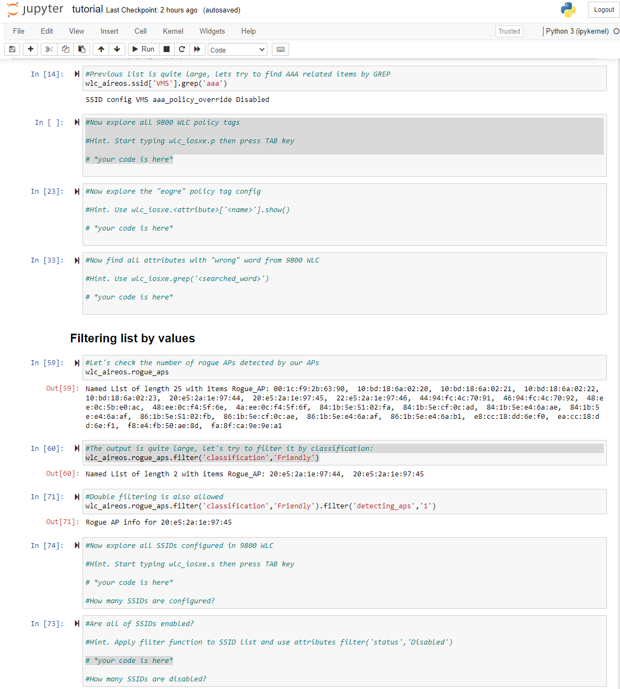

Interactive tutorial is the best way to learn new tool!

In order to enjoy learning just follw these 3 steps:
* download Docker container from [Docker hub](https://hub.docker.com/repository/docker/wlcpython/cisco-wlc-pythonizer) or pull by using command __docker pull wlcpython/cisco-wlc-pythonizer:latest__
* start container by following command: docker run -p 8888:8888 -v ~/wlc-pythonizer:/tmp:ro wlc-pythonizer
* open the test Jupyter notebook your browser http://127.0.0.1:8888/notebooks/app/notebooks/tutorial.ipynb

